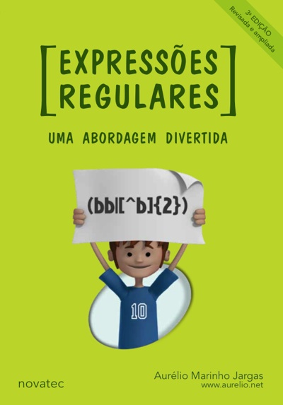
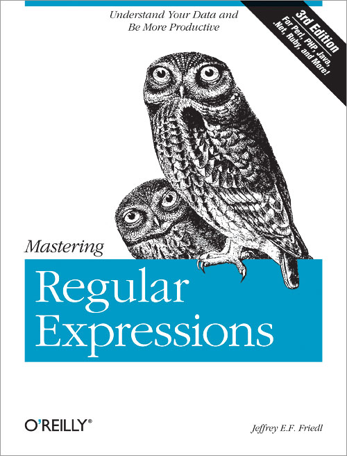
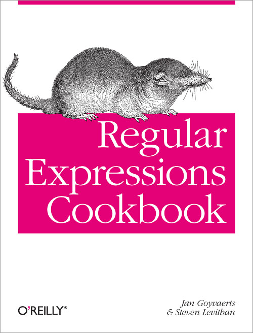
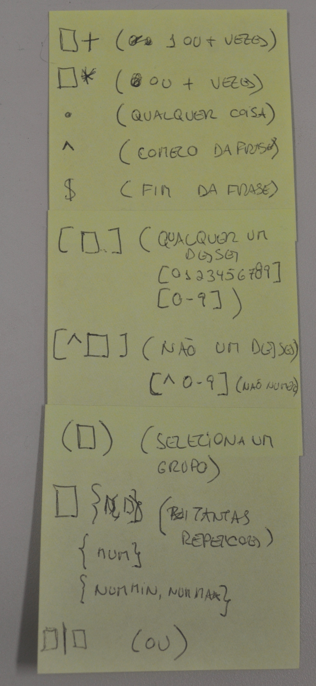
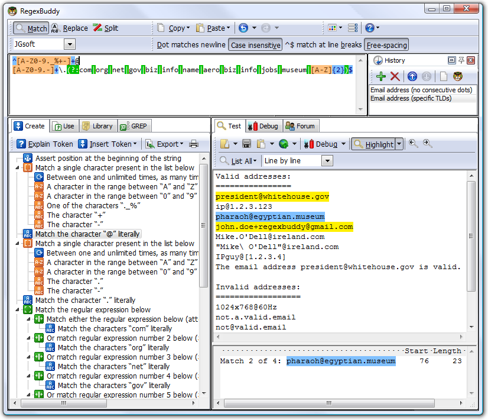

==================
Onde aprender mais
==================

Livros
======

   Expressões regulares: uma abordagem 
   divertida (3ª edição)

   :Autor: Aurélio Marinho Jargas
   :Editora: Novatec

   Mastering regular expressions (3rd. ed.)

   :Autor: Jeffrey E. F. Friedl
   :Editora: O'Reilly

regex-cookbook.jpg   

   Regular Expressions Cookbook

   :Autores: Jan Goyvaerts, Steven Levithan
   :Editora: O'Reilly

Resumos
=======

.. figure:: _static/regular-expressions-cheat-sheet-v2.png
   :scale: 10 %

   Regular Expressions Cheat Sheer v. 2

   Post-it® do Adriano Petrich

Software
========

   RegexBuddy (Windows, $39.95)

